# Introduction to SQL
> visit [SQLBolt](https://sqlbolt.com/) website ,If you want to practice more on SQL.

## Summary:
### What is SQL ?
You can communicate with relational databases using Structured Query Language (SQL), the standard language for interacting with management systems. SQL allows the joining of tables using a few lines of code, with a structure most nontechnical employees can learn quickly.

With SQL, analysts do not need to know where the order table resides on disk, how to perform the lookup to find a specific order, or how to connect the order and customer tables. The database compiles the query and figures out the correct data points.

### Relational databases:
A relational database represents a collection of related (two-dimensional) tables. Each of the tables are similar to an Excel spreadsheet, with a fixed number of named columns (the attributes or properties of the table) and any number of rows of data.

For example, imagine your company maintains a customer table that contains company data about each customer account and one or more transaction tables that contain data describing individual transactions.

The columns (or fields) for the customer table might be Customer ID, Company Name, Company Address, etc.; the columns for a transaction table might be Transaction Date, Customer ID, Transaction Amount, Payment Method, etc. The tables can be related based on the common Customer ID field. You can, therefore, query the table to produce valuable reports, such as a consolidated customer statement.

| Customer ID | Company Name | Company Address | Mobile Number |
| :----:  | :-----------: | :-----------: | :-----------: |
| 1 | Mac | Amman | 079... |
| 2 | FireFly | Amman | 079... |

Report generators take these queries and run them on demand to create formal reports. Many of the documents businesses run to track inventory, sales, finance, or even perform financial projections come from a relational database operating behind the scenes.

## SQL Lesson 1: SELECT queries 101
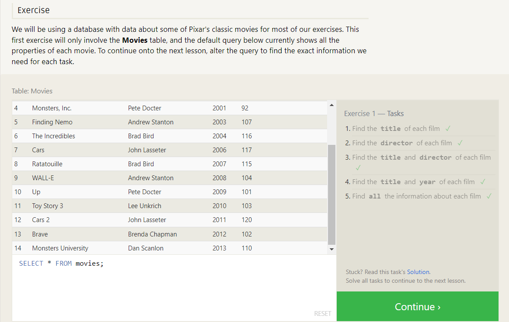
## SQL Lesson 2: Queries with constraints (Pt. 1)
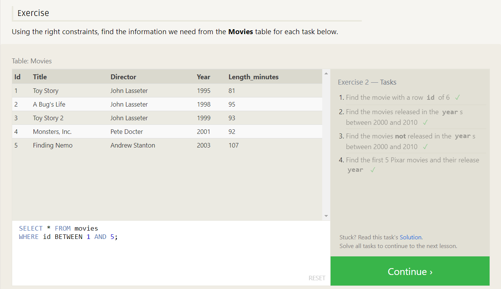
## SQL Lesson 3: Queries with constraints (Pt. 2)
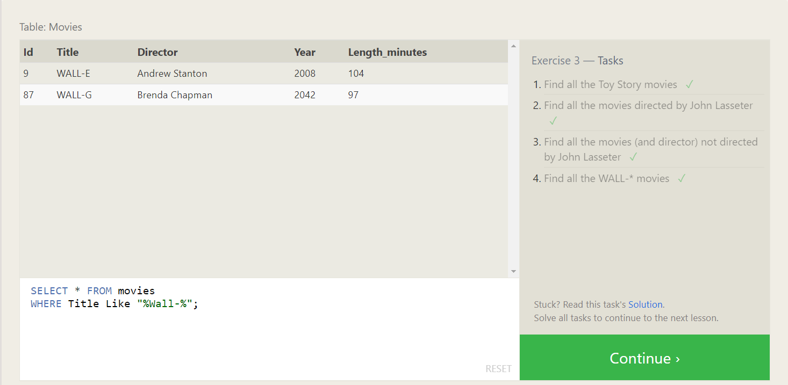
## SQL Lesson 4: Filtering and sorting Query results
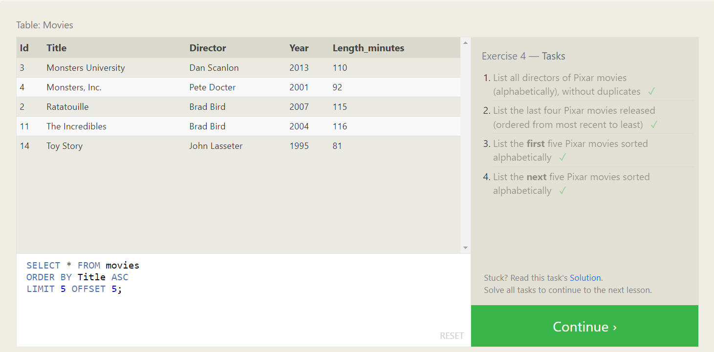
## SQL Lesson 5 (Review) : Simple SELECT Queries
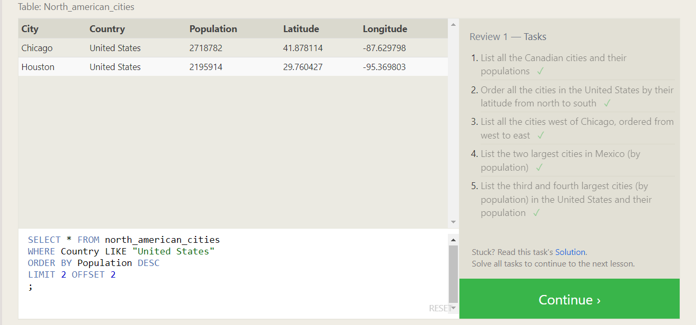
## SQL Lesson 6: Multi-table queries with JOINs
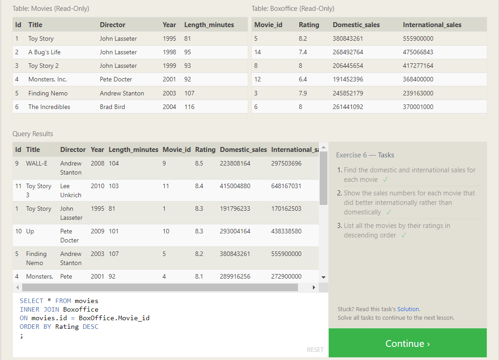
## SQL Lesson 13: Inserting rows
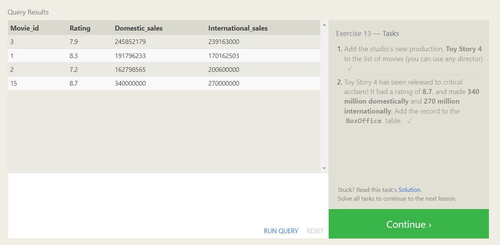
## SQL Lesson 14: Updating rows
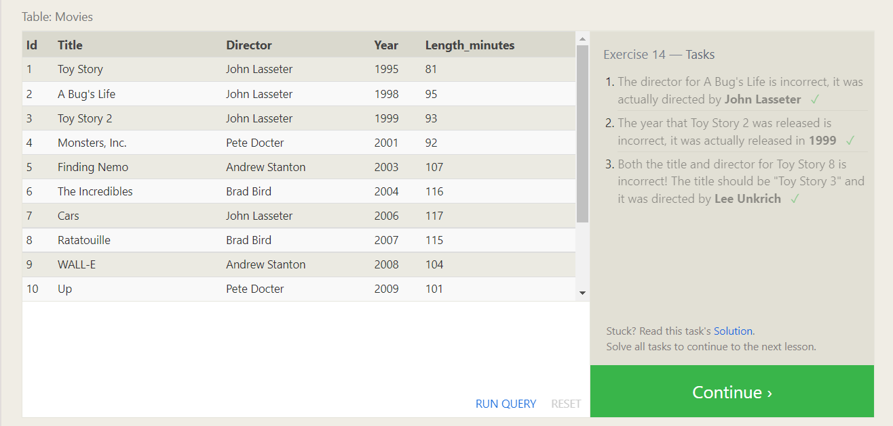
## SQL Lesson 15: Deleting rows
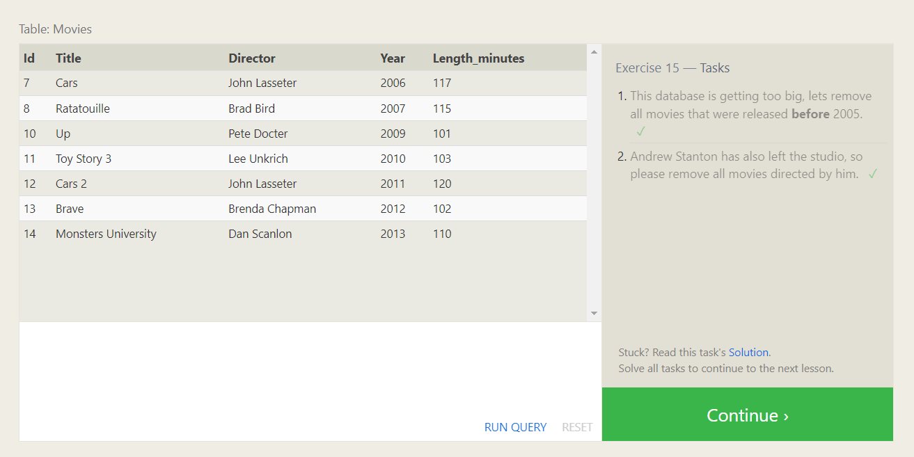
## SQL Lesson 16: Creating tables
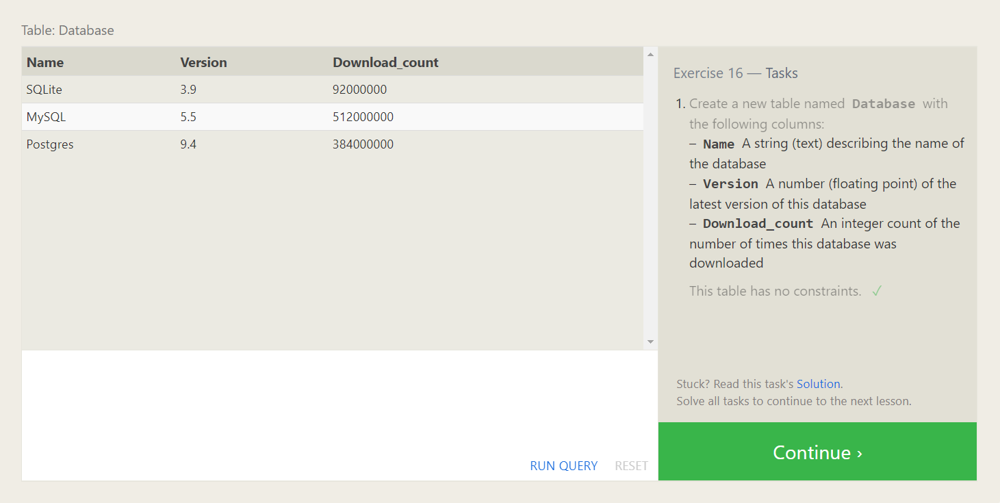
## SQL Lesson 17: Altering tables
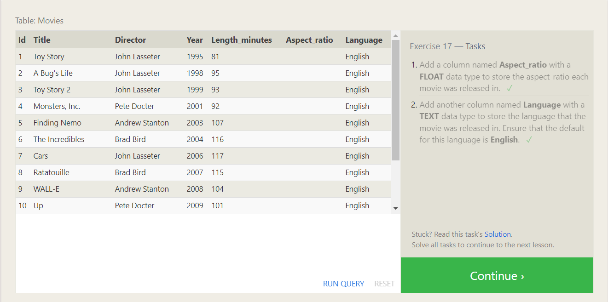
## SQL Lesson 18: Dropping tables
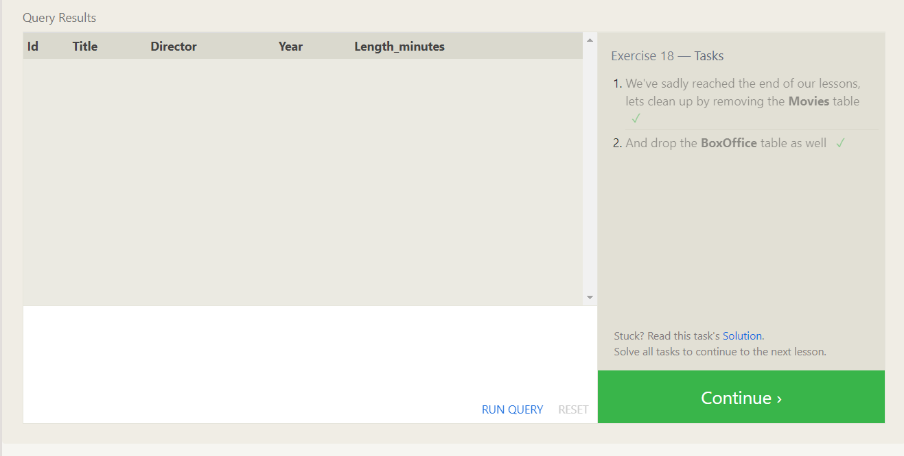

