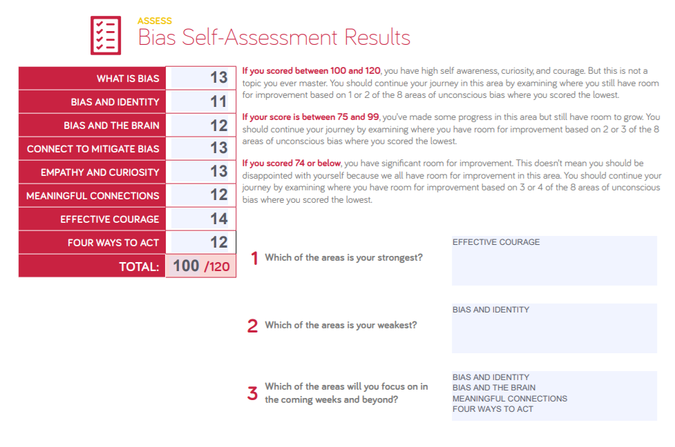

# Mindset
## Upgrade your technical skills with deliberate practice
- when we push ourselves out of confort zone, we start learn, oborvsion, research and analyse... these things what build our skills and our knowledge...
> Much of the benefit of learning a new technique or skill is the ability to apply it in novel situations.
## The power of believing that you can improve:
-- We have to say "not yet" to ourselves... we have to give ourselves a chance to try again and again.. in different ways.. to reach our goals.. but sometimes we still need someone to tell us "not yet"
- if we reach this point "I now realize I've wasted most of my life.", we have to think again about what should we do. As long as we're alive.. then we still have a chance.
## Grit: The power of passion and perseverance
> - "Grit is passion and perseverance for very long-term goals. Grit is having stamina. Grit is sticking with your future, day in, day out, not just for the week, not just for the month, but for years, and working really hard to make that future a reality. Grit is living life like it's a marathon, not a sprint."
> - "We need to take our best ideas, our strongest intuitions, and we need to test them. We need to measure whether we've been successful, and we have to be willing to fail, to be wrong, to start over again with lessons learned."

## A kinder, gentler philosophy of success 
> "So what I want to argue for is not that we should give up on our ideas of success, but we should make sure that they are our own. We should focus in on our ideas, and make sure that we own them; that we are truly the authors of our own ambitions. Because it's bad enough not getting what you want, but it's even worse to have an idea of what it is you want, and find out, at the end of the journey, that it isn't, in fact, what you wanted all along."

## Emotional intelligence:
- I got 20 points in Self-Awareness, 20 points in Self-Management, 17 points in Social Awareness, and 20 points in Relationship Management.
- I read a lot about emotional intelligence and try to practice it, but it's not easy to do everything correctly. 
- I believe we can manage our emotions and thoughts, but it needs for hardworking to reach a high level. if we manage it, we will feel big changes in our lives.
- I think, our environment effect so much on all these skills, so it will be very hard for some of us and easier for others.

## Assessing Bias

- Depending on my experience, sometimes we have to choose what is correct for us, not for others... I believe that we have to do our best to listen to others and understand what they want depending on the situation.
- I still believe that the environment controls us at some points in our life... I know we have to think in a positive way to achieve our goals and that is what the Bias test tried to tell us. so we have to hard work and think out of the box to reach what we need even it's too hard, but it is still possible.
