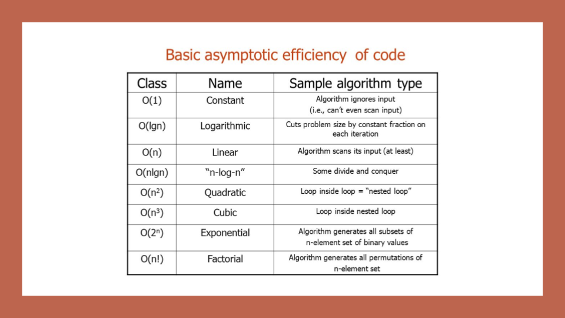

# Big O: Analysis of Algorithm Efficiency
Big O(oh) notation is used to describe the efficiency of an algorithm or function. This efficiency is evaluated based on 2 factors:

Running Time (also known as time efficiency / complexity)
The amount of time a function needs to complete.

Memory Space (also known as space efficiency / complexity)
The amount of memory resources a function uses to store data and instructions.

## Overview
Big O’s role in algorithm efficiency is to describe the Worst Case of efficiency an algorithm can have in performing it’s job. It specifically looks at the factors mentioned above, which we often refer to as Space and Time. In order to analyze these limiting factors, we should consider 4 Key Areas for analysis:

- Input Size.
- Units of Measurement.
- Orders of Growth.
- Best Case, Worst Case, and Average Case.



## What is a Linked List
A Linked List is a sequence of Nodes that are connected/linked to each other. The most defining feature of a Linked List is that each Node references the next Node in the link.

There are two types of Linked List - Singly and Doubly.

## Terminology:
- Linked List - A data structure that contains nodes that links/points to the next node in the list.
- Singly - Singly refers to the number of references the node has. A Singly linked list means that there is only one reference, and the reference points to the Next node in a linked list.
- Doubly - Doubly refers to there being two (double) references within the node. A Doubly linked list means that there is a reference to both the Next and Previous node.
- Node - Nodes are the individual items/links that live in a linked list. Each node contains the data for each link.
- Next - Each node contains a property called Next. This property contains the reference to the next node.
- Head - The Head is a reference of type Node to the first node in a linked list.
- Current - The Current is a reference of type Node to the node that is currently being looked at. When traversing, you create a new Current variable at the Head to guarantee you are starting from the beginning of the linked list.

## Traversal
When traversing a linked list, you are not able to use a foreach or for loop. We depend on the Next value in each node to guide us where the next reference is pointing. The Next property is exceptionally important because it will lead us where the next node is and allow us to extract the data appropriately.

The best way to approach a traversal is through the use of a while() loop. This allows us to continually check that the Next node in the list is not null. If we accidentally end up trying to traverse on a node that is null, a NullReferenceException gets thrown and our program will crash/end.

When traversing through a linked list, the Current variable will tell us where exactly in the linked list we are and will allow us to move/traverse forward until we hit the end.

## Traversal Example
Let’s put a use case on our traversal. We want to check whether or not our LinkedList Includes a specific value.

```
The pseudo-code for an Includes is as so:

ALGORITHM Includes (value)
// INPUT <-- integer value
// OUTPUT <-- boolean

  Current <-- Head

  WHILE Current is not NULL
    IF Current.Value is equal to value
      return TRUE

    Current <-- Current.Next

  return FALSE
  ```
  
Let’s talk out what exactly is happening:

We are first creating Current at the Head to guarantee we are starting from the beginning. (Remember that Head is always the first node in a Linked List)

We create a while loop. This loop will only run if the node that Current is pointing to is not null. This also means we can guarantee that we are still looking at a Node while the loop is running.

Once we are in the while loop, we are checking if the value of the current node is equal to the value we are looking for. Given the logic, if that condition is true, then we have found the value we were looking for, so we return true.

If the Current node does not contain the value we are looking for, we then must move Current to the next node that is being referenced. Again, because the condition of this while loop is to only run if we are still at a node, we can safely traverse to the next node without fear of getting a NullReferenceException.

At this point, the while loop is re-evaluated. Step 3 & 4 will continue until Current reaches the end of the LinkedList. We will know we are at the last node in the linked list because the current node will be null. Once this condition becomes true, the while loop breaks, and we now know that we are at the end.

Once we hit the end, we know that we did not find the value and return true at any point, so the value is not in the LinkedList. We return false.

Traversal Big O
The Big O of time for Includes would be O(n). This is because, at its worse case, the node we are looking for will be the very last node in the linked list. n represents the number of nodes in the linked list.

The Big O of space for Includes would be O(1). This is because there is no additional space being used than what is already given to us with the linked list input.
## What’s a Linked List, Anyway? [Part 1]
Regardless of which language we start coding in, one of the first things that we encounter are data structures, which are the different ways that we can organize our data; variables, arrays, hashes, and objects are all types of data structures. But these are still just the tip of the iceberg when it comes to data structures; there are a lot more, some of which start to sound super complicated the more that you hear about them.

One characteristic of linked lists is that they are linear data structures, which means that there is a sequence and an order to how they are constructed and traversed. We can think of a linear data structure like a game of hopscotch: in order to get to the end of the list, we have to go through all of the items in the list in order, or sequentially.

The fundamental difference between arrays and linked lists is that arrays are static data structures, while linked lists are dynamic data structures. A static data structure needs all of its resources to be allocated when the structure is created; this means that even if the structure was to grow or shrink in size and elements were to be added or removed, it still always needs a given size and amount of memory. If more elements needed to be added to a static data structure and it didn’t have enough memory, you’d need to copy the data of that array

A single node is also pretty simple. It has just two parts: data, or the information that the node contains, and a reference to the next node.

## Lists for all shapes and sizes
Even though the parts of a linked list don’t change, the way that we structure our linked lists can be quite different. Like most things in software, depending on the problem that we’re trying to solve, one type of linked lists might be a better tool for the job than another.
Singly linked lists are the simplest type of linked list, based solely on the fact that they only go in one direction. There is a single track that we can traverse the list in; we start at the head node, and traverse from the root until the last node, which will end at an empty null value.
But just as a node can reference its subsequent neighbor node, it can also have a reference pointer to its preceding node, too! This is what we call a doubly linked list, because there are two references contained within each node: a reference to the next node, as well as the previous node. This can be helpful if we wanted to be able to traverse our data structure not just in a single track or direction, but also backwards, too.
